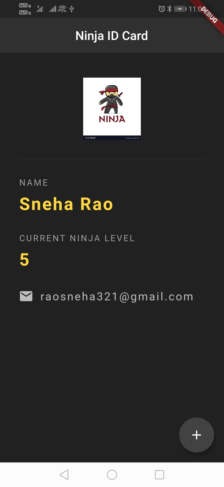

# ninja_id

A new Flutter application.

## Getting Started

This project is a starting point for a Flutter application.

The app used different features like Row Widgets, Column Widgets, Stateless and Stateful widgets, Scaffold, Padding, Buttons and divider.
This app is basic Ninja ID app which shows different details of applicant.

